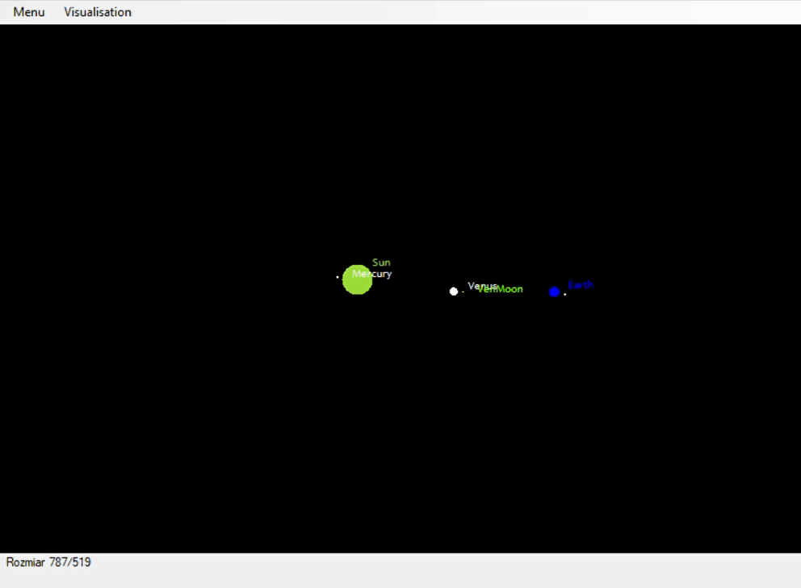
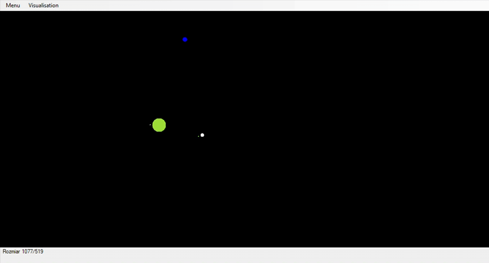

# MaxGravity
Project written in c# Visual Studio

## Own physics engine,
properties of objects:
- mass,
- speed, 
- location

calculated properties:
- gravity, 
- gravitational acceleration, 
- interaction of objects, 
- speed, 
- direction, 
- momentum, 
- gravitational constant

### Simulation of objects in space.
Gravitational interaction between objects.
Draw with VS Graphics in a separate thread.

